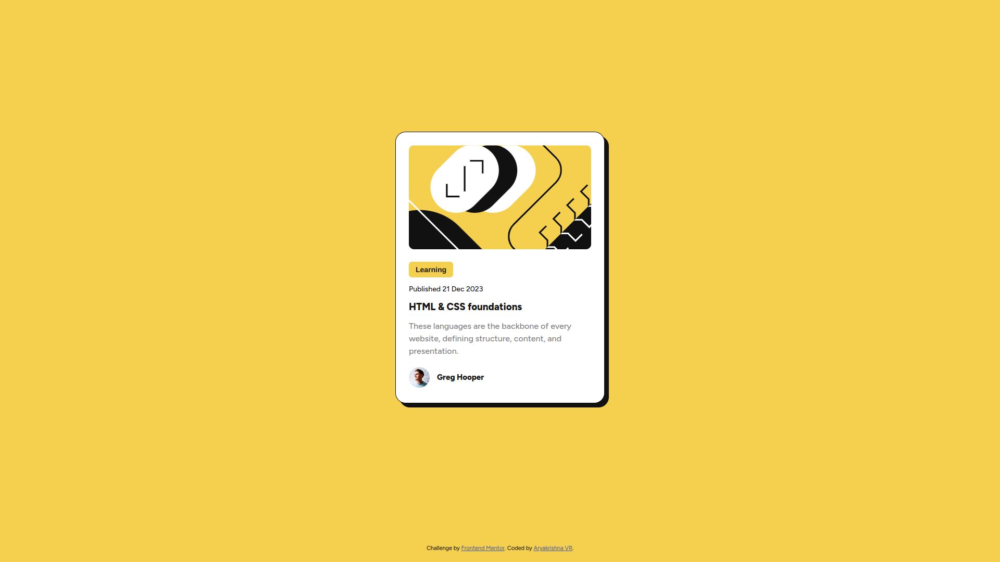

# Frontend Mentor - QR code component solution

This is a solution to the [Blog preview card challenge on Frontend Mentor](https://www.frontendmentor.io/challenges/blog-preview-card-ckPaj01IcS). Frontend Mentor challenges help you improve your coding skills by building realistic projects. 

## Table of contents

- [Overview](#overview)
  - [Screenshot](#screenshot)
  - [Links](#links)
- [My process](#my-process)
  - [Built with](#built-with)
  - [What I learned](#what-i-learned)
  - [Useful resources](#useful-resources)

## Overview
This is a solution to the [Blog preview card challenge on Frontend Mentor](https://www.frontendmentor.io/challenges/blog-preview-card-ckPaj01IcS).

### Screenshot

### Links
- Solution URL: [https://github.com/aryakrishnaksh2021/challenge-blog_preview_card](https://github.com/aryakrishnaksh2021/challenge-blog_preview_card)
- Live Site URL: [https://6638fa29783c73f641f72896--earnest-panda-410d44.netlify.app/](https://6638fa29783c73f641f72896--earnest-panda-410d44.netlify.app/)

## My process
I started with bulding the layout of the design using HTML elements, then adding style class to each element. After that, I added the media query for the responsive design.Finally done the lighthouse audit for the performance and accessibility. Then made changes according with the best practices.

### Built with
- Semantic HTML5 markup
- CSS custom properties
- CSS animations
- Flexbox
- CSS Grid
- Mobile-first workflow

### What I learned
I learned more about the flex properties and gap  property in CSS, as well as how to use them effectively for layout. I also practiced using media query.

### Useful resources
- [https://www.w3schools.com/](https://www.w3schools.com/) - This helped me for understanding CSS in a better way.It Give me an idea about css animations, and fontface uses
